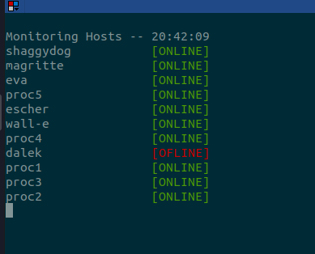

# clusterLab
Cluster Framework to abuse the machines on my lab 

# Configure
1. Install Requirements: `pip3 install -r requirements.txt`
2. Setup SSH Keys: [https://www.digitalocean.com/community/tutorials/how-to-set-up-ssh-keys-2](https://www.digitalocean.com/community/tutorials/how-to-set-up-ssh-keys-2)


# Monitoring Hosts

```bash
python3 clab.py monitor --config config_lab.yaml
```



# Sending Comands Hosts

```bash
python3 clab.py dispatch -i testargs.txt
```