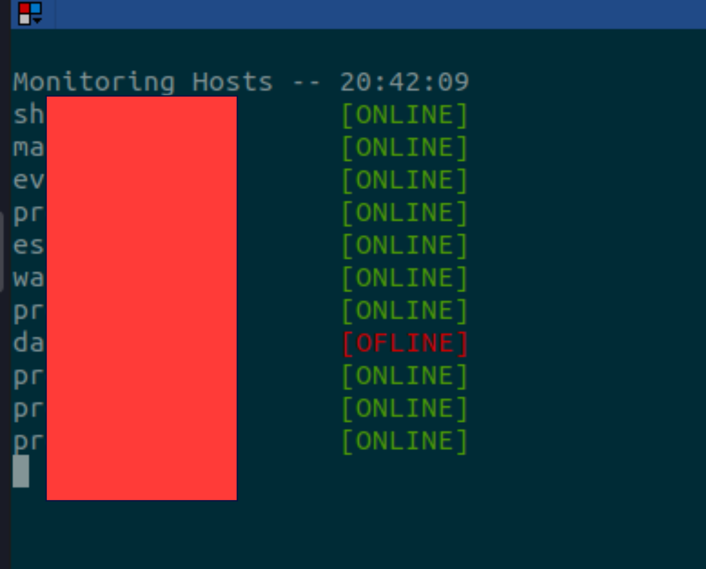

# clusterLab
Cluster Framework to abuse the machines on my lab 

# Configure
1. Install Requirements: `pip3 install -r requirements.txt`
2. Setup SSH Keys: [https://www.digitalocean.com/community/tutorials/how-to-set-up-ssh-keys-2](https://www.digitalocean.com/community/tutorials/how-to-set-up-ssh-keys-2)


# Monitoring Hosts

```bash
python3 clab.py monitor --config config_lab.yaml
```



# Sending Comands Hosts

```bash
python3 clab.py dispatch -i testargs.txt
```

**Expected Log: `clab.log`**

```
02/05/2021 08:47:10 PM --> [localhost]-09 | Running CMD: python3 /homeLocal/Github/clusterLab/test.py 
02/05/2021 08:47:10 PM --> [localhost]-04 | Running CMD: python3 /homeLocal/Github/clusterLab/test.py 
02/05/2021 08:47:10 PM --> [localhost]-03 | Running CMD: python3 /homeLocal/Github/clusterLab/test.py 
02/05/2021 08:47:10 PM --> [localhost]-01 | Running CMD: python3 /homeLocal/Github/clusterLab/test.py 
02/05/2021 08:47:10 PM --> [localhost]-00 | Running CMD: python3 /homeLocal/Github/clusterLab/test.py 
02/05/2021 08:47:10 PM --> [localhost]-06 | Running CMD: python3 /homeLocal/Github/clusterLab/test.py 
02/05/2021 08:47:10 PM --> [localhost]-08 | Running CMD: python3 /homeLocal/Github/clusterLab/test.py 
02/05/2021 08:47:10 PM --> [localhost]-02 | Running CMD: python3 /homeLocal/Github/clusterLab/test.py 
02/05/2021 08:47:10 PM --> [localhost]-05 | Running CMD: python3 /homeLocal/Github/clusterLab/test.py 
02/05/2021 08:47:10 PM --> [localhost]-07 | Running CMD: python3 /homeLocal/Github/clusterLab/test.py 
02/05/2021 08:47:21 PM --> [localhost]-09 | Running CMD: python3 /homeLocal/Github/clusterLab/test.py 
02/05/2021 08:47:21 PM --> [localhost]-03 | Running CMD: python3 /homeLocal/Github/clusterLab/test.py 
02/05/2021 08:47:21 PM --> [localhost]-01 | Running CMD: python3 /homeLocal/Github/clusterLab/test.py 
02/05/2021 08:47:21 PM --> [localhost]-00 | Running CMD: python3 /homeLocal/Github/clusterLab/test.py 
02/05/2021 08:47:21 PM --> [localhost]-08 | Running CMD: python3 /homeLocal/Github/clusterLab/test.py 
02/05/2021 08:47:21 PM --> [localhost]-04 | Running CMD: python3 /homeLocal/Github/clusterLab/test.py 
02/05/2021 08:47:21 PM --> [localhost]-06 | Running CMD: python3 /homeLocal/Github/clusterLab/test.py 
02/05/2021 08:47:21 PM --> [localhost]-05 | Running CMD: python3 /homeLocal/Github/clusterLab/test.py 
02/05/2021 08:47:21 PM --> [localhost]-02 | Running CMD: python3 /homeLocal/Github/clusterLab/test.py 
02/05/2021 08:47:21 PM --> [localhost]-07 | Running CMD: python3 /homeLocal/Github/clusterLab/test.py 
02/05/2021 08:47:31 PM --> [localhost]-03 | Running CMD: python3 /homeLocal/Github/clusterLab/test.py 
02/05/2021 08:47:31 PM --> [localhost]-09 | Running CMD: python3 /homeLocal/Github/clusterLab/test.py 
02/05/2021 08:47:31 PM --> [localhost]-01 | Running CMD: python3 /homeLocal/Github/clusterLab/test.py 
02/05/2021 08:47:31 PM --> [localhost]-04 | Running CMD: python3 /homeLocal/Github/clusterLab/test.py 
```